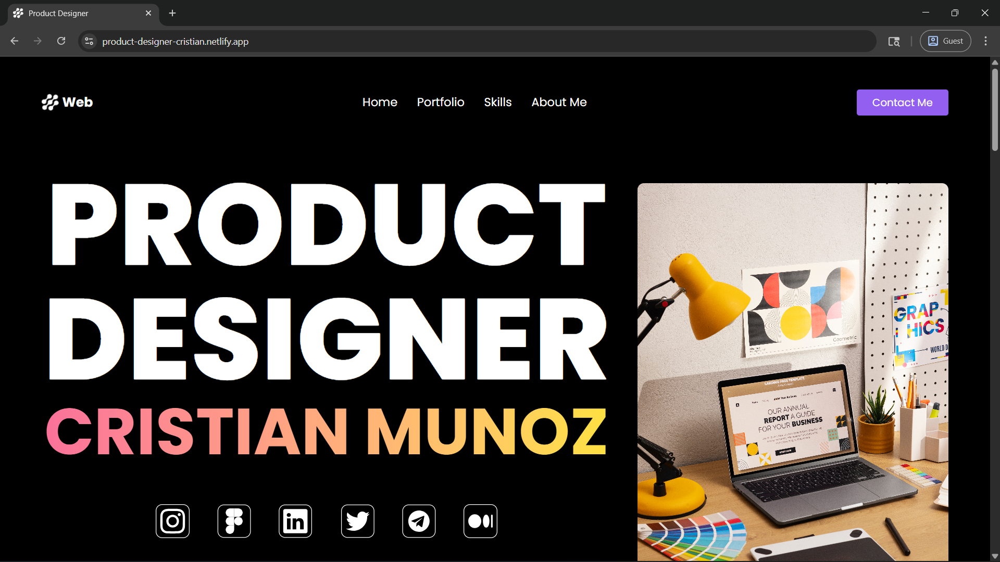
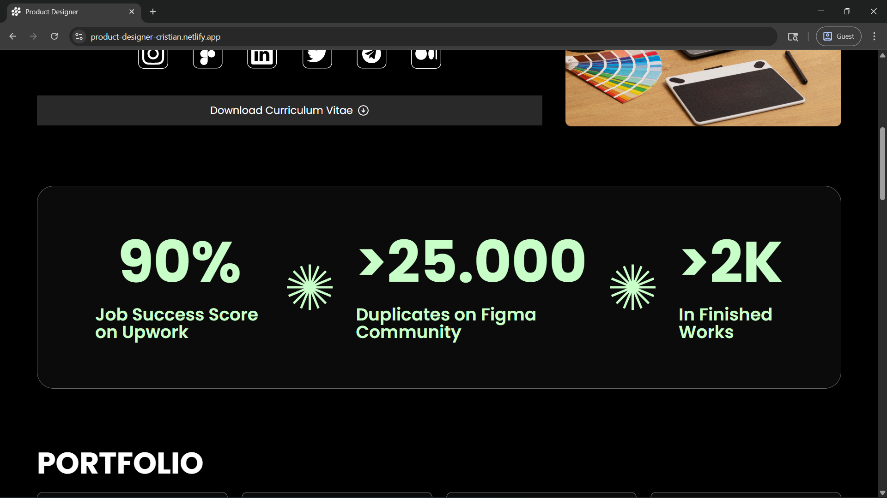
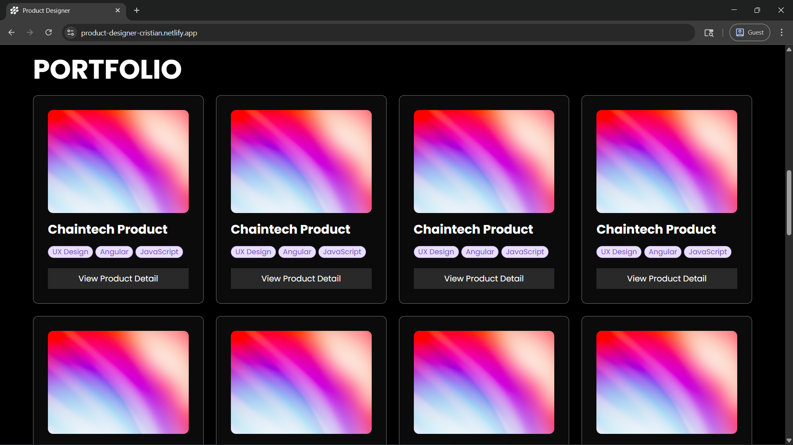
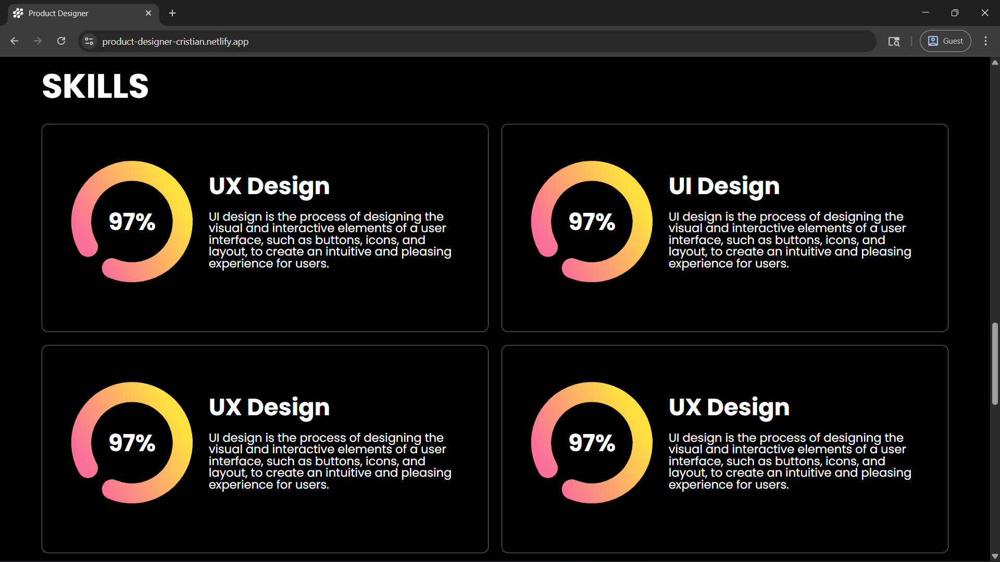
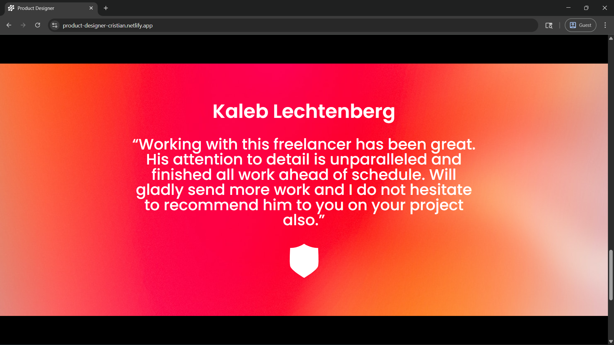
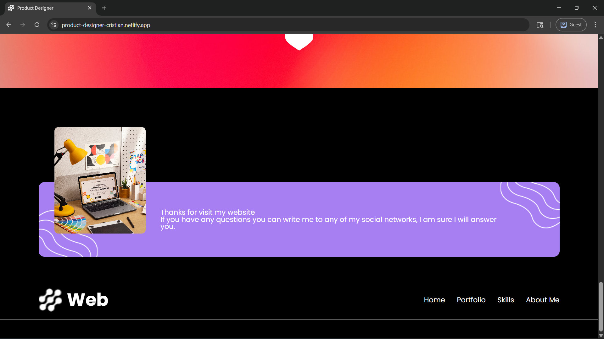

# 🚀 Cristian Munoz - Product Designer Portfolio

Welcome to the portfolio website of Cristian Munoz, a dedicated Product Designer passionate about crafting visually stunning and user-friendly digital experiences. This repository contains the code for the website, converted from a Figma design into a responsive React.js application.

---

## 🌐 Live Demo

You can check out the live version of the application here:

👉 [Live Demo of Store Rating System](https://product-designer-cristian.netlify.app)

---

## ✨ Features

* **Modern Design**: A sleek and professional design that highlights key information and projects.

* **Responsive Layout**: Optimized for various devices, from mobile phones to large desktop screens, ensuring a seamless user experience.

* **Portfolio Showcase**: Dedicated section to display design projects with titles and categories.

* **Skill Overview**: Visual representation of design skills with percentage indicators.

* **Client Testimonials**: A section to feature feedback from satisfied clients.

* **Semantic HTML**: Structured with ```<header>```, ```<main>```, ```<section>```, ```<footer>``` for better accessibility and SEO.

* **Reusable Components**: Built with React components for maintainability and scalability (e.g., Buttons, Cards, Skill Indicators).

* **Accessibility Focused**: Includes alt tags for images.

---

## 📸 Screenshots
Here are some screenshots of the deployed application to give you a visual overview:













---

## 🛠️ Technologies Used

* **React.js**: A JavaScript library for building user interfaces.

* **Tailwind CSS**: A utility-first CSS framework for rapid UI development.

* **Google Fonts (Poppins)**: For modern and clean typography.

---

## 🚀 Getting Started
To get a local copy up and running, follow these simple steps.

### Prerequisites

Node.js (LTS version recommended)

```bash
npm
```

### Installation

📝 Clone the repository:

```bash
git clone https://github.com/Omashree/product-designer.git
```

📂 Navigate to the project directory:

```bash
cd product-designer
```

📦 Install dependencies:

```bash
npm install
```

▶️ Start the development server:

```bash
npm run dev
```

The application will typically open in your browser at [http://localhost:5173](http://localhost:5173).

---

## 📄 License
Distributed under the MIT License. See LICENSE for more information.